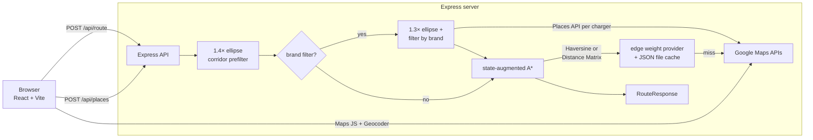

# Volt

A battery-aware EV trip planner. Pick a start, a destination, your car, and
a few constraints — Volt searches the US Tesla Supercharger network and
returns the route that minimizes total trip time (driving + charging),
along with restaurants near each stop.

The interesting parts are inside `server/src/algo` and
`server/src/graph` — A\* over a sparse charger graph, with battery and
optional stop-count constraints handled in the state space rather than
post-hoc filtering.

## Architecture



| Layer | What's in it |
|---|---|
| `client/` | React 19 + TS + Vite + Tailwind v4 + shadcn/ui (Nova). Route form, map (`@react-google-maps/api`), Places autocomplete, results panel with per-stop restaurants |
| `server/` | Express 5 (ESM) + TS. Routing engine, places proxy, JSON-file caches for edge weights and restaurants. Rate-limited at 30 req/min/IP |
| `shared/` | `@volt/shared` workspace — wire types (`RouteRequest`, `RouteResponse`, `Restaurant`, `Brand`) used by both sides |

## Routing algorithm

The graph is dense in the dataset (every charger is a potential node) but
sparse for any given trip after two prefilters:

1. **Spatial corridor.** Before A\* runs, candidate chargers are reduced to
   those inside an ellipse with foci at the start and end points where
   `haversine(start, c) + haversine(c, end) ≤ 1.4 × haversine(start, end)`.
   This drops a SF→LA search from 2,711 candidates to ~480, and a
   coast-to-coast NYC→LA from 2,711 to ~2,679 (still most of the country).
2. **Brand corridor** (only when the user picks restaurant brands). A
   tighter 1.3× ellipse, then a parallel Places API lookup keeps only
   chargers near a matching brand. Results are cached so the second call
   on the same corridor pays no API cost.

A\* itself uses:

- **State key `(chargerId, stopsSoFar)`** when `maxStops` is set, plain
  `chargerId` otherwise. This matters because the time-optimal path to a
  given charger may visit more stops than the constraint allows; without
  the stop count in the state, A\* would discard the slower-but-feasible
  alternative.
- **Charge-to-need policy.** Battery isn't part of the state space.
  Instead, the cost of edge `current → next` includes whatever charging
  is needed at `current` to reach `next` with the safety buffer
  (`minArrivalBatteryPct` at the destination, 10% at intermediate stops).
  This keeps the state space finite without needing to bucket battery
  levels.
- **Haversine-time heuristic.** `haversine(current, end) / 88 km h⁻¹` —
  admissible because straight-line distance ≤ driving distance.
- **Binary min-heap PQ** in `server/src/algo/heap.ts`.

Charging time is modeled linearly at the charger's rated power against a
Tesla-ish 155 Wh/km. Real DC fast charging tapers above ~80%; that's a
known simplification documented in the source.

## Performance

All numbers below are local development with `USE_HAVERSINE_EDGES=true`
(no external Distance Matrix calls in the benchmark). End-to-end means
curl-to-response.

| Route | Candidates after corridor | A\* expansions | Stops | Latency |
|---|---:|---:|---:|---:|
| SF → LA | 476 | 262 | 3 | 76 ms |
| SF → LA, `maxStops=2` | 476 | 474 | 2 | 90 ms |
| SF → LA, In-N-Out filter | **74** | 41 | 3 | 24 ms |
| NYC → LA | 2,679 | 1,660 | 17 | 835 ms |
| Seattle → Portland | 63 | 43 | 1 | 4 ms |
| LA → San Diego (no stops needed) | 192 | 134 | 0 | 23 ms |
| Phoenix → Denver | 147 | 65 | 3 | 6 ms |

Notable wins:

- **NYC → LA went from 96 s to 835 ms** when the corridor prefilter was
  added and the stop-count state encoding was made conditional on
  `maxStops` being set. The biggest single performance fix in the
  project.
- **Brand filter shrinks the candidate set** (476 → 74 for SF→LA / In-N-Out)
  without sacrificing the optimal route, because A\* runs on the
  pre-filtered subset rather than iterating with exclusion.
- **State-augmented A\* costs ~2× expansions** vs unconstrained (474 vs 262 on the
  same SF → LA), as expected since the state space roughly doubles.

The Places API cache had **443 hits / 0 misses** on a warm SF→LA brand
filter call — every charger in the corridor was already cached from
prior calls. The cache is a JSON file written at runtime to
`server/src/data/` (gitignored).

## Getting started

### Prerequisites

- Node.js 20+
- A [Google Maps API key](https://console.cloud.google.com/apis/credentials) with **Maps JavaScript API**, **Places API (new)**, and **Geocoding API** enabled. Distance Matrix is optional — see env vars below.

### Setup

```bash
npm install
cp client/.env.example client/.env
cp server/.env.example server/.env
# add your key to both as described below
```

### Run

```bash
npm run dev:server   # http://localhost:3001
npm run dev:client   # http://localhost:5173
```

The client's Vite dev server proxies `/api/*` to the backend.

### Test

```bash
npm test --workspace=server   # 63 vitest cases across A*, heap, validation, corridor, places
```

## Configuration

| Variable | Where | What it does |
|---|---|---|
| `VITE_GOOGLE_MAPS_API_KEY` | `client/.env` | Maps JS SDK key. Restrict by HTTP referrer in production |
| `GOOGLE_MAPS_API_KEY` | `server/.env` | Server-side key used for Places (new) + optional Distance Matrix. Restrict by IP in production |
| `USE_HAVERSINE_EDGES` | `server/.env` | `true` (default) approximates edges with Haversine × 1.2 detour at 88 km/h. `false` uses the real Distance Matrix API with the JSON file cache |
| `PORT` | `server/.env` | Server port (default 3001) |

## API

### `POST /api/route`

```jsonc
{
  "start": { "lat": 37.77, "lng": -122.42 },
  "end":   { "lat": 34.05, "lng": -118.24 },
  "vehicleRangeKm": 400,
  "startBatteryPct": 90,
  "minArrivalBatteryPct": 10,

  // optional
  "maxStops": 2,                          // 0–10
  "excludeChargerIds": ["3294"],          // exclude specific chargers
  "restaurantBrandIds": ["in-n-out"]      // ids from shared/src/brands.ts
}
```

Returns `{ stops, totalDistanceKm, totalDrivingTimeMin, totalChargingTimeMin, totalTripTimeMin }`. Each stop carries the charger, arrival/departure battery %, charging time, and distance + drive time from the previous waypoint.

### `POST /api/places`

```jsonc
{ "chargerIds": ["7676", "3294", "7430"] }
```

Returns a map of charger id → up to 6 nearby restaurants (name, formatted address, rating, price level) within 800 m. Server-side Places API call, key never leaves the backend.

### `GET /api/health`

Returns service status.

## Engineering decisions worth surfacing

These are choices I'd defend in an interview, not just defaults:

- **Charge-to-need over battery-buckets.** Bucketing battery in the state
  space (a common textbook approach) explodes the graph by ~20×. Folding
  charging into the edge cost keeps state finite and the algorithm
  understandable. Real-world taper above 80% is acknowledged and parked
  for a later refinement.
- **State-augmented A\* only when `maxStops` is set.** Always tracking
  stop count makes the unconstrained planner ~2× slower for no benefit.
  The conditional encoding fell out of the 96 s → 835 ms regression and
  is documented as a hot path.
- **Corridor prefilter at 1.4× before any other work.** Tighter ratios
  occasionally cut a charger that lies on the optimal path; 1.4× was the
  smallest factor I tested that didn't change any benchmark route's
  output vs the unfiltered baseline.
- **Brand filter runs server-side, not client-iteration.** An earlier
  version of the client iteratively excluded off-brand chargers and
  replanned. It stalled in suburban clusters around the start (e.g. the
  Bay Area has many chargers near office parks without In-N-Out). The
  server now identifies the brand-eligible candidate set up front and
  runs A\* once.
- **Two-level Google API key separation.** The client uses a referrer-
  restricted key for the Maps JS SDK and Places Autocomplete (those have
  to run in the browser). The server uses an IP-restricted key for
  Places REST and Distance Matrix, keeping those calls server-side and
  cacheable.
- **JSON file cache instead of Redis/DynamoDB for local dev.** Same shape
  as a future DynamoDB cache (key → JSON value, batchable). The
  promotion path is a `getEdgeWeight` swap, not a rewrite.

## Roadmap

- **Phase 4 — AWS deploy.** Lambda + API Gateway, DynamoDB edge cache, `USE_HAVERSINE_EDGES=false` for real driving times.
- **Post-internship v2 — SaaS.** Auth + persistent favorites + saved trips. Most likely a switch from DynamoDB to Postgres for the user data.

## License

MIT
