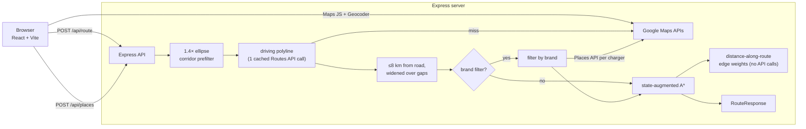

# Volt

A battery-aware EV trip planner. Pick a start, a destination, your car, and
a few constraints — Volt searches the US Tesla Supercharger network and
returns the route that minimizes total trip time (driving + charging),
along with restaurants near each stop.

The interesting parts are inside `server/src/algo` and
`server/src/graph` — A\* over a sparse charger graph, with battery and
optional stop-count constraints handled in the state space rather than
post-hoc filtering.

## Architecture


```mermaid
flowchart LR
    Browser["Browser<br/>React + Vite"] -->|POST /api/route| API[Express API]
    Browser -->|POST /api/places| API
    Browser -->|Maps JS + Geocoder| GMaps[Google Maps APIs]

    subgraph Server [Express server]
        API --> Corridor["1.4× ellipse<br/>corridor prefilter"]
        Corridor --> Polyline["driving polyline<br/>(1 cached Routes API call)"]
        Polyline -->|miss| GMaps
        Polyline --> RoadCorridor["≤8 km from road,<br/>widened over gaps"]
        RoadCorridor --> BrandFilter{brand filter?}
        BrandFilter -->|yes| InnerCorridor["filter by brand"]
        BrandFilter -->|no| AStar
        InnerCorridor -->|Places API per charger| GMaps
        InnerCorridor --> AStar["state-augmented A*"]
        AStar --> Edges["distance-along-route<br/>edge weights (no API calls)"]
        AStar --> Response[RouteResponse]
    end
```

| Layer | What's in it |
|---|---|
| `client/` | React 19 + TS + Vite + Tailwind v4 + shadcn/ui (Nova). Route form, map (`@react-google-maps/api`), Places autocomplete, results panel with per-stop restaurants. Deploys to Vercel |
| `server/` | Express 5 (ESM) + TS. Routing engine, places proxy. Runs locally as `tsx watch` and in production as an AWS Lambda (via `serverless-http`) behind API Gateway. Rate-limited at 30 req/min/IP |
| `shared/` | `@volt/shared` workspace — wire types (`RouteRequest`, `RouteResponse`, `Restaurant`, `Brand`) used by both sides |
| `infra/` | AWS CDK app (`VoltStack`) — provisions the Lambda, API Gateway HTTP API, and three DynamoDB tables (edge-weight cache + places cache and polyline cache with TTL) |

Caches are dual-mode: locally the server writes JSON files under `server/src/data/`; in Lambda it reads/writes the DynamoDB tables injected via `EDGE_CACHE_TABLE`, `PLACES_CACHE_TABLE`, and `POLYLINE_CACHE_TABLE`.

## Routing algorithm

The graph is dense in the dataset (every charger is a potential node) but
sparse for any given trip after three prefilters:

1. **Spatial corridor.** Candidate chargers are first reduced to those
   inside an ellipse with foci at the start and end points where
   `haversine(start, c) + haversine(c, end) ≤ 1.4 × haversine(start, end)`.
   This drops a SF→LA search from 2,711 candidates to ~480 and is cheap
   enough to run on every request — it bounds the cost of the next step.
2. **Route-first corridor** (`USE_ROUTE_POLYLINE=true`, the default). One
   Routes API call (`TRAFFIC_UNAWARE`, so it bills on the cheap Compute
   Routes Essentials SKU; cached by grid-snapped endpoints with a 30-day
   TTL) fetches the actual driving polyline. Every ellipse survivor is
   projected onto it, keeping only chargers within 8 km of the road.
   Where that leaves a stretch of road longer than `0.9 × vehicleRangeKm`
   without a charger, the corridor widens locally (25 km, then 60 km) so
   sparse regions stay solvable. Portland→LA drops from 767 ellipse
   candidates to ~85 actual I-5 chargers. If the Routes API is
   unavailable, the planner falls back to the plain ellipse + haversine
   behavior.
3. **Brand corridor** (only when the user picks restaurant brands). A
   parallel Places API lookup keeps only chargers near a matching brand.
   Results are cached so the second call on the same corridor pays no
   API cost.

Edge weights come from the polyline too: the road distance between two
chargers is the difference of their along-route positions plus one
off-road leg per endpoint, and driving time uses the route's real average
speed — road-accurate edges with **zero** per-pair API calls (the old
Haversine × 1.2 and Distance Matrix providers remain as fallbacks).

A\* itself uses:

- **State key `(chargerId, stopsSoFar, socBucket)`**. The SoC (state of
  charge) at each charger is bucketed to 5% granularity (∶20 buckets).
  This lets the planner explore different departure-SoC choices: at each
  stop A\* enumerates feasible departure levels from the minimum needed
  to reach the next stop up to 95%, in 5% steps. With non-linear
  charging curves, overcharging at a fast low-SoC rate to skip a later
  slow charger becomes a real optimization the planner can exploit.
  `stopsSoFar` is still included when `maxStops` is set, so the
  stop-count constraint remains respected.
- **Haversine-time heuristic.** `haversine(current, end) / 88 km h⁻¹` —
  admissible because straight-line distance ≤ driving distance.
- **Binary min-heap PQ** in `server/src/algo/heap.ts`.

### Charging curve

Charging time uses a piecewise-linear model of delivered power vs. SoC,
based on Tesla V3 Supercharger data:

| SoC band | Delivered power |
|----------|-----------------|
| 0–50 %   | 250 kW          |
| 50–80 %  | 120 kW          |
| 80–95 %  | 60 kW           |
| 95–100 % | 30 kW           |

Each segment's power is capped at the charger's rated power —
a 150 kW charger never delivers 250 kW. Time is integrated analytically
per band. The previous linear model under-estimated high-SoC charging by
~3–4×, which prevented the planner from discovering that two short stops
can beat one long stop.

## Performance

All numbers below predate the route-first corridor and were measured with
`USE_ROUTE_POLYLINE=false` and `USE_HAVERSINE_EDGES=true` (no external
API calls in the benchmark). End-to-end means curl-to-response.

With route-first planning on (the default), the candidate set shrinks to
chargers actually on the highway, so the search gets faster on top of
being road-accurate: Portland→LA runs at 85 candidates / ~1,100
expansions / ~65 ms warm (~700 ms on a polyline-cache miss), versus 767
candidates / ~6,500 expansions / ~2.2 s for the same trip through the
ellipse fallback.

| Route | Candidates after corridor | A\* expansions | Stops | Latency |
|---|---:|---:|---:|---:|
| SF → LA | 476 | ~5,000–8,000 | 3 | ~200–400 ms |
| SF → LA, `maxStops=2` | 476 | ~8,000–12,000 | 2 | ~300–500 ms |
| SF → LA, In-N-Out filter | **74** | ~800–1,200 | 3 | ~50–100 ms |
| NYC → LA | 2,679 | ~30,000–50,000 | 17 | ~5–10 s |
| Seattle → Portland | 63 | ~600–900 | 1 | ~20–40 ms |
| LA → San Diego (no stops needed) | 192 | ~2,000–3,000 | 0 | ~80–150 ms |
| Phoenix → Denver | 147 | ~1,000–1,500 | 3 | ~40–80 ms |

*Expansion counts are estimated ranges after the SoC-bucket state
augmentation (5% granularity). The state space is ~10–20× larger than
the previous charge-to-need approach, but the planner can now discover
that charging more at a fast low-SoC charger and skipping a later stop
is faster overall.*

Notable wins:

- **NYC → LA went from 96 s to 835 ms** when the corridor prefilter was
  added and the stop-count state encoding was made conditional on
  `maxStops` being set. The biggest single performance fix in the
  project.
- **Brand filter shrinks the candidate set** (476 → 74 for SF→LA / In-N-Out)
  without sacrificing the optimal route, because A\* runs on the
  pre-filtered subset rather than iterating with exclusion.
- **Departure-SoC enumeration** trades more expansions for better route
  quality. The planner can now exploit the non-linear charging curve
  (cheap kWh below 50% SoC at 250 kW) to overcharge at fast chargers
  and skip slower intermediate ones.

The Places cache is three-tier: per-process memory → DynamoDB
(production) or a JSON file (local dev) → Google Places API. On a warm
SF→LA brand filter call every charger in the corridor is an in-memory
hit and no API or DynamoDB calls happen. Concurrent requests for the
same charger are coalesced into one fetch, and DynamoDB items carry a
90-day TTL so stale entries expire automatically. Per-request log lines
break the stats out as `places(mem/ddb/miss)=…`.

A one-time `warm-places-cache.ts` script (`server/src/scripts/`) walks
all ~2,711 US chargers and populates the cache, so the first
brand-filtered route a real user runs doesn't pay the API cost. Point it
at DynamoDB by setting `PLACES_CACHE_TABLE` before running it.

## Getting started

### Prerequisites

- Node.js 20+
- A [Google Maps API key](https://console.cloud.google.com/apis/credentials) with **Maps JavaScript API**, **Places API (new)**, **Routes API**, and **Geocoding API** enabled. Distance Matrix is optional — see env vars below.

### Setup

```bash
npm install
cp client/.env.example client/.env
cp server/.env.example server/.env
# add your key to both as described below
```

### Run

```bash
npm run dev:server   # http://localhost:3001
npm run dev:client   # http://localhost:5173
```

The client's Vite dev server proxies `/api/*` to the backend.

### Test

```bash
npm test --workspace=server   # 109 vitest cases across A*, heap, validation, corridor, polyline, projection, places
```

## Configuration

| Variable | Where | What it does |
|---|---|---|
| `VITE_GOOGLE_MAPS_API_KEY` | `client/.env` | Maps JS SDK key. Restrict by HTTP referrer in production |
| `VITE_API_URL` | `client/.env` | Optional. Leave blank for local dev (Vite proxies `/api/*` to the local server). In production set to the API Gateway URL printed by `cdk deploy` |
| `GOOGLE_MAPS_API_KEY` | `server/.env` / Lambda env | Server-side key used for Places (new) + Routes + optional Distance Matrix. Restrict by IP in production |
| `USE_ROUTE_POLYLINE` | `server/.env` / Lambda env | `true` (default) plans route-first: one cached Routes API call per request gives the driving polyline used for the corridor and edge weights. `false` (or any polyline failure) falls back to the ellipse corridor with the edge provider below |
| `USE_HAVERSINE_EDGES` | `server/.env` / Lambda env | Fallback edge provider when the polyline is unavailable. `true` (default) approximates edges with Haversine × 1.2 detour at 88 km/h. `false` uses the real Distance Matrix API. In Lambda stay on Haversine until the edge cache is pre-warmed |
| `EDGE_CACHE_TABLE` | Lambda env (set by CDK) | DynamoDB table for edge weights. Unset locally → falls back to `server/src/data/edge-cache.json` |
| `PLACES_CACHE_TABLE` | Lambda env (set by CDK) | DynamoDB table for restaurant lookups (with 90-day TTL). Unset locally → falls back to `server/src/data/places-cache.json` |
| `POLYLINE_CACHE_TABLE` | Lambda env (set by CDK) | DynamoDB table for driving polylines (30-day TTL, keyed by ~2 km grid-snapped endpoints). Unset locally → falls back to `server/src/data/polyline-cache.json` |
| `PORT` | `server/.env` | Server port (default 3001) |

## API

### `POST /api/route`

```jsonc
{
  "start": { "lat": 37.77, "lng": -122.42 },
  "end":   { "lat": 34.05, "lng": -118.24 },
  "vehicleRangeKm": 400,
  "startBatteryPct": 90,
  "minArrivalBatteryPct": 10,

  // optional
  "maxStops": 2,                          // 0–10
  "excludeChargerIds": ["3294"],          // exclude specific chargers
  "restaurantBrandIds": ["in-n-out"]      // ids from shared/src/brands.ts
}
```

Returns `{ stops, totalDistanceKm, totalDrivingTimeMin, totalChargingTimeMin, totalTripTimeMin, encodedPolyline? }`. Each stop carries the charger, arrival/departure battery %, charging time, and distance + drive time from the previous waypoint. `encodedPolyline` is the driving route geometry (present when route-first planning is active); the client draws it on the map.

### `POST /api/places`

```jsonc
{ "chargerIds": ["7676", "3294", "7430"] }
```

Returns a map of charger id → up to 6 nearby restaurants (name, formatted address, rating, price level) within 800 m. Server-side Places API call, key never leaves the backend.

### `GET /api/health`

Returns service status.

## Deployment

The server runs on AWS Lambda behind API Gateway, provisioned by the CDK
app in `infra/`. The client deploys to Vercel as a static build.

```bash
# Backend (requires AWS credentials + GOOGLE_MAPS_API_KEY exported)
cd infra
npx cdk deploy

# Optional: pre-warm the places cache in DynamoDB so the first real
# brand-filtered request doesn't pay the Places API cost (~$87 one-time).
PLACES_CACHE_TABLE=VoltStack-PlacesCache... \
  npx tsx server/src/scripts/warm-places-cache.ts

# Frontend
cd client && vercel deploy --prod
```

## License

MIT
